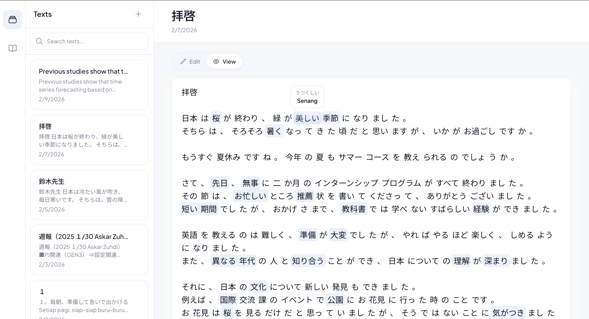
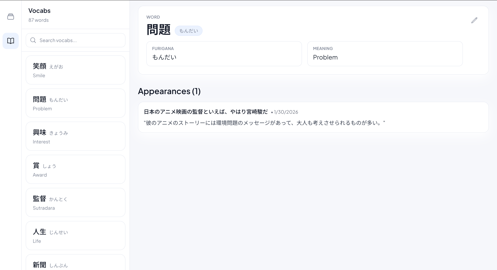

# Yomeru (読める) - Japanese Reading & Vocab Learning App

**Learn Japanese by reading.** Save your texts, click words to add them to your vocabulary bank with meanings, furigana, and custom notes. Watch your vocabulary grow as you read.

---

## ✨ Features

- 📝 **Save and organize Japanese texts** - Store articles, stories, or any Japanese content you want to read
- 🔤 **Smart tokenization** - Automatically breaks down text into clickable words with furigana tooltips
- 💾 **One-click vocabulary saving** - Click any word to save it with meanings, furigana, and personal notes
- 🔍 **Search everything** - Quickly find vocabs and texts in your collection
- 📊 **Track word usage** - See where each vocabulary word appears across all your saved texts
- 🎯 **Dictionary form normalization** - Conjugated verbs and adjectives automatically saved as dictionary forms for better learning

---

## 📸 Screenshots

### Reading Interface
Click any word in your text to save it to your vocabulary bank. Words you've already saved are highlighted.



### Vocabulary Detail
View all the places where a word appears in your reading materials, complete with sentence context.



---

## Tech Stack

- **Monorepo**: Turborepo + npm workspaces
- **Frontend**: Next.js 14 (App Router) + TypeScript + Tailwind CSS
- **Backend**: Express + TypeScript
- **Database**: PostgreSQL + Prisma ORM
- **Tokenizer**: Kuromoji (Japanese morphological analyzer)
- **Deployment**: Docker

## Project Structure

```
yomeru-app/
├── apps/
│   ├── web/          # Next.js frontend
│   └── api/          # Express backend
├── packages/         # Shared packages (if needed)
├── docker-compose.yml
└── package.json
```

## Getting Started

### Prerequisites

- Node.js 18+
- npm 8+
- Docker & Docker Compose (optional, for containerized setup)

### Local Development (without Docker)

1. Install dependencies:

```bash
npm install
```

2. Set up environment variables:

```bash
cp apps/api/.env.example apps/api/.env
```

Edit `apps/api/.env` and update the `DATABASE_URL` if needed.

3. Start PostgreSQL (you can use Docker for just the database):

```bash
docker run -d \
  --name yomeru-postgres \
  -e POSTGRES_USER=yomeru \
  -e POSTGRES_PASSWORD=yomeru_dev_pass \
  -e POSTGRES_DB=yomeru \
  -p 5432:5432 \
  postgres:16-alpine
```

4. Run Prisma migrations:

```bash
cd apps/api
npm exec prisma migrate dev --name init
npm exec prisma generate
```

5. Start development servers:

```bash
# From root directory
npm dev
```

This will start:

- Frontend at http://localhost:3000
- Backend at http://localhost:3001

### Docker Development

1. Start all services:

```bash
docker-compose up -d
```

2. Run Prisma migrations:

```bash
docker-compose exec api npm exec prisma migrate dev --name init
```

3. Access the application:

- Frontend: http://localhost:3000
- Backend: http://localhost:3001

## 🎯 How It Works

1. **Save a text** - Paste or create a Japanese text (article, story, sentence practice, etc.)
2. **Switch to View mode** - The text is automatically tokenized into clickable words
3. **Click any word** - A modal appears with auto-filled furigana (from the dictionary form)
4. **Add meaning & notes** - Fill in the meaning and any personal notes you want
5. **Build your vocab bank** - Words are saved in their dictionary form for consistent learning
6. **See word usage** - Click any vocabulary to see every sentence where it appears across all your texts

### Current Features

- ✅ Text editor with Edit/View mode toggle
- ✅ Automatic Japanese text tokenization (Kuromoji)
- ✅ Smart vocabulary saving (dictionary form normalization)
- ✅ Furigana tooltips on hover
- ✅ Vocabulary highlighting (shows saved words)
- ✅ Search & filter for both texts and vocabs
- ✅ Word appearance tracking with sentence context
- ✅ Keyboard shortcuts (Cmd+F for search, Cmd+E for mode toggle)

## API Endpoints

| Method | Endpoint           | Description                      |
| ------ | ------------------ | -------------------------------- |
| POST   | `/api/tokenize`    | Tokenize Japanese text           |
| GET    | `/api/vocabs`      | Get all vocabs                   |
| POST   | `/api/vocabs`      | Create vocab                     |
| GET    | `/api/vocabs/:id`  | Get vocab + appearances          |
| GET    | `/api/texts`       | Get all texts                    |
| POST   | `/api/texts`       | Create text                      |
| GET    | `/api/texts/:id`   | Get text + vocabs                |
| POST   | `/api/text-vocabs` | Link vocab to text with sentence |

## Routes

| Route          | Description       |
| -------------- | ----------------- |
| `/`            | Paste new text    |
| `/vocabs`      | Vocabulary list   |
| `/vocabs/[id]` | Vocabulary detail |
| `/texts`       | Saved texts list  |
| `/texts/[id]`  | Text detail       |

## Database Schema

### vocabs

- id, word, furigana, meaning, notes, created_at

### texts

- id, title, content, source, created_at

### text_vocabs (junction table)

- id, vocab_id, text_id, sentence, created_at

## Development Commands

```bash
# Install dependencies
npm install

# Start dev servers (all apps)
npm dev

# Build all apps
npm build

# Lint
npm lint

# Clean build artifacts
npm clean
```

## 🚀 Roadmap / Future Ideas

- 🔐 Authentication for multi-user support
- 💻 Desktop app with Tauri/Electron
- 📤 Export vocabulary to Anki (`.apkg` format)
- 🧠 SRS (Spaced Repetition System) with review queue
- 📈 Statistics dashboard (vocab count, learning streak, word frequency)
- 🏷️ Tags & categories for organizing texts and vocabs
- 🎨 Dark mode
- 🖊️ Text selection mode (manually select phrase ranges for compound words)

## License

Private project
